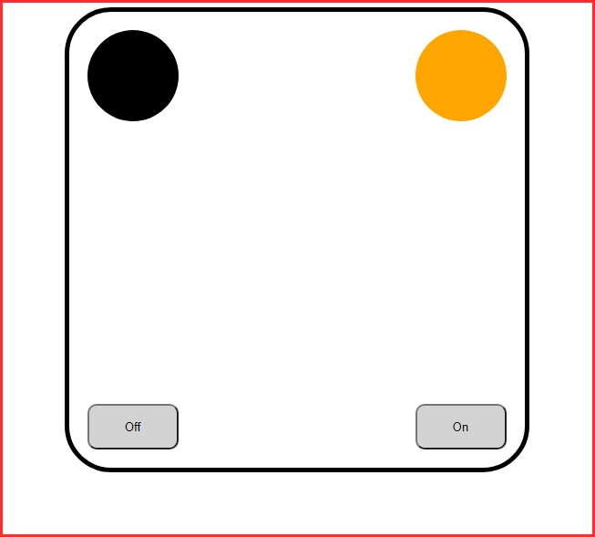

# LightBox
## Basic React App (codealong)
### Practice **React States** and **React Props**

---

- Credits: 
- https://www.freecodecamp.org 
- Course from Thomas Weibenfalk. Check out his Youtube channel: https://www.youtube.com/channel/UCnnnWy4UTYN258FfVGeXBbg
- Check out the video where he explains the project in great details: https://www.youtube.com/watch?v=nTeuhbP7wdE

